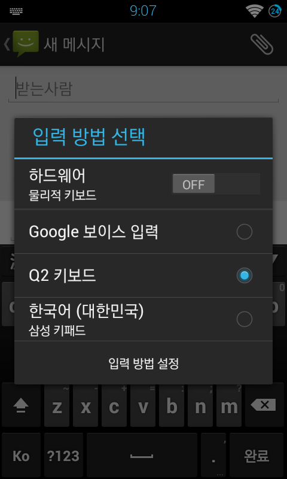

LG 옵티머스Q2 (LG-LU6500) 관련 iCAROS7 자료 모음집
커스텀롬 관련 모음

본 글은 [여기](https://minnote.net/icaros7%20works/BSSQ-Download/)에서 더 많은 정보를 확인 하실 수 있습니다.

블로그 이전 하는 동안 이전 2013~2014년경 배포 하였던 제 자료 중 복구가 가능 한 것들을 추스렸습니다.
LU6500 옵티머스Q2 관련 자료 만 모았습니다. 여러 버전을 소유한 경우 가장 최신 버전만 작성 하였습니다.

이때 github 미사용 및 사용 중이던 파일 호스트 사이트들이 대부분 문을 닫아 자료 복구가 대부분 안됩니다.



# 사용법
본 글의 모든 커스텀롬의 경우 TWRP, CWM 등의 커스텀 리커버리에서 사용이 가능한 업데이트ZIP 입니다.

# LU650137 순정 펌웨어 + 루팅
1. <a href="https://drive.google.com/file/d/1lBTCCTntGJp7sx_yhfGFXMRrHAS-1iyA/view?usp=sharing" target="_blank">구글 드라이브</a>

LU650137 순정 펌웨어에 루팅만 되어있는 Flashable Update ZIP 입니다.

# iCAROS ModX 2.1.0 Stable for LU650137
1. <a href="https://drive.google.com/file/d/1nEHWssvNn4B81XyZMmyAqU3_d9jZibxL/view?usp=sharing" target="_blank">구글 드라이브</a>

## 체인지로그
- Q메모 탑제
- Icaros Orange Theme v7 탑제
- CM용 Root Browser 탑제
- MX플레이어 내장 (코덱은 사용자 설치)
- R@m Manager Pro 기본 탑제
- build.prop 트윅 추가
- ICS C@mera + 기본 탑제 (기본 카메라 앱 탑제)
- 부팅 애니메이션 슈퍼레이서님의 부팅애니메이션으로 교체

# CyanogenMod 10
## Alpha 01
**Dev-Host 사이트가 폐쇠되며 Alpha 02, 03자료가 유실 되었습니다.**
1. <a href="https://drive.google.com/file/d/1tSU-Njho-kHQ1iuzfsIbSLKlPJZEUVDq/view?usp=sharing" target="_blank">구글 드라이브</a>

**절대로 Wipe data/factory reset을 하지마시오**

### Not Working
- 플래시
- 하드웨어 쿼티 키보드 (일부 특수키만 동작불능)
- 통신
- 얼굴인식 잠금해제

### Add-on
1. <a href="https://drive.google.com/file/d/1PqmEZoG_AuoEXvh5kGN36YCrqKeUwy_4/view?usp=sharing" target="_blank">framework-res.apk</a>   
    물리적 키보드를 아예 사용이 불가능하게 해주는 framework-res.apk 입니다.

# Provision4
## Alpha 02
1. <a href="https://drive.google.com/file/d/1tSU-Njho-kHQ1iuzfsIbSLKlPJZEUVDq/view?usp=sharing" target="_blank">구글 드라이브</a>
2. <a href="http://www.box.com/s/80ck9ux9hmbhu9e1gocu" target="_blank">Box</a>

**절대로 Wipe data/factory reset을 하지마시오**

### Not Working
- 플래시
- 하드웨어 쿼티 키보드 (일부 특수키만 동작불능)
- 통신
- 얼굴인식 잠금해제

# MIUI
## 2.3.16
1. <a href="https://drive.google.com/file/d/1oAF9r6nnnjiuEkoqeD0dx_ugiziyMO6Q/view?usp=sharing" target="_blank">구글 드라이브</a>