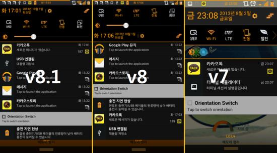

본 글은 [여기](https://minnote.net/icaros7%20works/BSSQ-Download/)에서 더 많은 정보를 확인 하실 수 있습니다.

블로그 이전 하는 동안 이전 2013~2014년경 배포 하였던 제 자료 중 복구가 가능 한 것들을 추스렸습니다.
LU6500 옵티머스Q2 관련 자료 만 모았습니다. 여러 버전을 소유한 경우 가장 최신 버전만 작성 하였습니다.

이때 github 미사용 및 사용 중이던 파일 호스트 사이트들이 대부분 문을 닫아 자료 복구가 대부분 안됩니다.



# 사용법
본 글의 모든 커스텀롬의 경우 TWRP, CWM 등의 커스텀 리커버리에서 사용이 가능한 업데이트ZIP 입니다.

# iCAROS Vold Patch -> LU650137 펌웨어
/sdcard (내장 SD 영역)과 /external_sd (외장 SD 영역)을 서로 바꿔주는 패치 입니다.

## Enabler
1. <a href="https://drive.google.com/file/d/1Q5rycXU2abOsdC4esg2rWjhQ2kKkXDWc/view?usp=sharing" target="_blank">구글 드라이브</a>

## Disabler
1. <a href="https://drive.google.com/file/d/1QcBtnc6qTtmN8WvRybw-CLpvEJn0yi5x/view?usp=sharing" target="_blank">구글 드라이브</a>

# iCAROS Orange v8 -> LU650131+@ 펌웨어
예전에 제가 좋아하던 오랜지 색 베이스의 테마 입니다. v8과 v8.1은 밝기 슬라이더 위치가 다릅니다.

## v8
1. <a href="https://drive.google.com/file/d/1OYhckBSMHX_xGLfxFAgh4SRXyRNM3gJe/view?usp=sharing" target="_blank">구글 드라이브</a>

## v8.1
1. <a href="https://drive.google.com/file/d/1fHn7Cj1B8Qj3LJR6H0NYQkDBMWvQPx9Q/view?usp=sharing" target="_blank">구글 드라이브</a>

# iCAROS Optimus UI 2.5 -> LU650128 펌웨어
LU650128 펌웨어에서 사용이 가능한 LU650137 펌웨어 테마 입니다.

## Beta 1
1. <a href="https://drive.google.com/file/d/13mi37-cxO7f5jXQKf2iWqMFrDFsYspTs/view?usp=sharing" target="_blank">구글 드라이브</a>

TWRP, CWM 등에서 사용이 가능한 업데이트 ZIP 형식이 아닙니다!