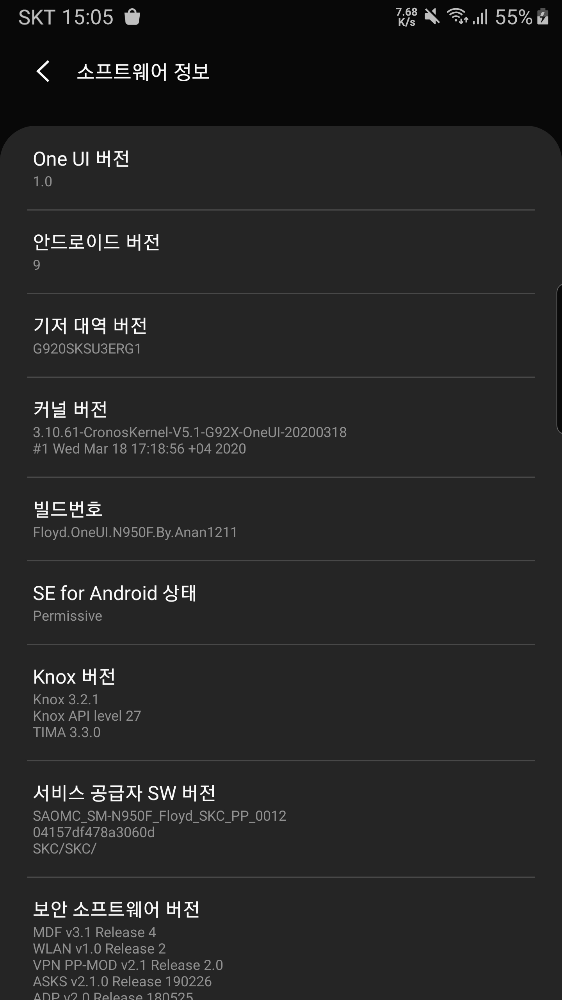

갤럭시S6 다시 살려 사용하기! 안드로이드 9.0 및 OneUI 1.0 업데이트

안녕하세요!   
서론이 길다면 우측 또는 상단의 목차에서 [`1. 알아두셔야 할 점`](#1.-알아두셔야-할-점) 부터 읽어주세요~

체인지로그
- 2021년 3월 29일
  - 게임툴즈(부스터) 관련 추가
  - 자잘한 번역 업데이트
  - 글 가독성 개선
- 2021년 6월 6일 16:54
  - 오탈자 수정
  - 글 가다듬기 및 정리

저는 별도의 다른 폰이 있고, 부가회선을 갤럭시로 사용하여 전자지갑으로 활용하고 있습니다. 갤럭시S6을 사용하다가 갤럭시A50으로 지갑용 기기를 교체하여 더이상 갤럭시S6은 삼성페이가 필요하지 않게 되었습니다.

갤럭시S6 최신 안드로이드의 경우 `Samsung Experience 8.0`(이하 SE 8.0) 이라 불리는 UI를 탑제한 `안드로이드 7.0`가 최신 버전 입니다. 하지만 `SE 8.1` 혹은 `SE 8.5`부터 대거 기능들이 탑제되며 상대적 구버전인 `SE 8.0`의 경우 없는 기능이나 사용자 경험이 다소 부족하였습니다.

이를 해소하기 위해 Xda 등에 업로드되어있는 신버전 앱을 구형기기에서 사용가능하도록 Modded 된 앱을 설치하거나 하였지만 이 역시 한계가 있습니다. 또한 갤럭시의 유명 기능인 `GearLock` 기능 역시 `OneUI` 탑제 기종부터 가능하므로 사용 불가능한 기능 입니다.

이를 해결하기 위하여 갤럭시 노트8의 최신 안드로이드인 `OneUI 1.0`을 포함한 `안드로이드 9.0 파이` 펌웨어를 갤럭시S6과 같은 엑시노스7420을 사용하는 기기에 알맞게 구성한 롬을 설치할 것 입니다.

# 1. 알아두셔야 할 점
기본적으로 커스텀 롬에 관한 이해 혹은 지식이 부족한 분들을 기준으로 알려드리겠습니다.

1. 본 글을 따라하시면 삼성전자의 보안 관련 기능과 메인보드 관련 무상 A/S 진행이 **불능** 합니다
2. **또한 모든 작업은 본 글을 따라하는 사용자에게 있으며, 복구 관련 문의는 받지 않습니다**
3. 아래 사항들은 한번 시도한다면 **영원히 복구가 불능**. 복구를 원할 경우 삼성 A/S센터 내방하여 **20만원 상당의 메인보드를 교체** 해야만 합니다.

## 1-1. 장점
- 새롭게 설치될 안드로이드 버전은 `9.0`
- `CronosKernel`이라 불리는 커스텀커널을 통한 성능 및 배터리 최적화 (상당한 차이)
- GoodLock 기능 사용 가능
- 다크 모드
- Always On Display 사용 가능
- Edge 관련 기능 사용 가능

사실 콕 찝어 말할 수 없을 만큼 여러가지 기능들이 많이 생깁니다.

## 1-2. 단점 및 버그 관련 안내

- Knox 일부 기능
  - 삼성 페이 관련 기능 사용 불능
  - 삼성 페스 관련 기능 사용 불능 (구글 비밀번호 자동완성으로 대체 하여 사용 중)
  - 삼성 헬스 관련 기능 사용 불능
- Knox 워런티 깨짐으로 인한 금융 앱 사용 불능 (우회 방법이 있겠지만 전 A50에서 사용 중이라 무관)

아래와 같은 사항은 사용할 Floyd Note8 Port 롬의 버그 및 사용 불가 기능 입니다.

- 하드웨어 컴포저 (앱 렌더링 방식 중 하나이며, OneUI 소스가 공개가 안되어있어 사용이 불가능)
  - 일반적 사용자가 실사용 할 경우 체감은 안됌
- 카메라 관련 일부 사항
  - 직접 확인 결과 동영상 촬영은 별도 앱 필요
  - 사진의 경우 삼성 기본 카메라 앱 사용 가능 (자동 밝기 비활성시에만 사용 가능)
  - 서드파티 앱 (카카오톡, Whatsapp 등)에서 카메라를 실행하는 기능이 있는 경우 해당 기능 작동 유무 불확실
- S6 및 S6 Edge 의 경우 삼성 갤러리 앱 실행시 일시적 화면 깜빡거림
- 삼성 갤러리 앱 클라우드 동기화 시 사진이 제대로 표시되지 않음
  - 내장 사진의 경우 정상 표시
- 충전기 연결 및 연결 해제시 간혈적으로 와이파이 사용이 불능한 현상 발생

위 사항들을 모두 숙지하였음에도 이득이라 생각되신다면 이 글이 상당한 도움이 될 것 입니다. 사실 금융앱을 사용하지 않는 공기계라면 하는 것이 여러모로 도움이 됩니다.

# 2. 준비물 및 환경 구성 안내
   
본 글은 아래와 같은 환경을 기준으로 작성 되었습니다.

- 한국 SKT 정발 갤럭시S6 (SM-G920S)
  - KT SM-G920K, LGU SM-G920L 모두 가능
  - 해외 S6, S6 Edge (SM-G925x), S6 Edge+ (SM-G928x), 노트5 (SM-N920x) 모두 가능, 하지만 본 글에선 S6을 기준으로 하므로 별도 파일 및 과정 필요
- 사용 유심 통신사 SKT
- 별도 개조 상태가 아닌 모든 것이 기본 상태
- Windows 10 랩톱

또한 필요한 것들을 설명 드리겠습니다. 다운로드 링크가 첨부 된 경우 제가 사용 한 파일들 입니다. 제가 신원을 보장 드리는 사이트는 아니므로 직접 구하셔도 무방합니다.

1. PC와 데이터 통신이 가능한 USB 케이블
2. Floyd Note8 Port 파일 / <a href="https://forum.xda-developers.com/t/rom-9-0-oneui-n920x-g92x-floyd-note8-port-v5-1.3882804/" target="_blank"> ananjaser1211씨의 XDA 포스트</a>
  - 위 링크에서 2번째 쓰레드(포스트)의 "Downloads" 부분 참조
  - 한국에선 GoogleDrive를 통하여 다운로드 권장
3. 삼성 모바일 USB 드라이버 / <a href="https://developer.samsung.com/mobile/android-usb-driver.html" target="_blank">developer.samsung.com</a>
  - 상단의 "Samsung_USB_Driver~~~"라 적힌 둥근 버튼 클릭
4. 모바일 오딘 3.12.3 / <a href="https://odindownload.com/download/#.YCttnZdxcow" target="_blank">odindownload.com</a>
  - "SamsungOdin 3.12.3" 를 검색 후 하단에 있는 Download Now 이미지를 클릭
5. zeroflte(G920SLK) 용 TWRP 이미지 / <a href="https://dl.twrp.me/zeroflteskt/" target="_blank">twrp.me</a>
  - 가장 최신 버전의 "twrp-3.3.1-0-zeroflteskt.img.tar" 를 클릭
  - 국내판 SKT, KT, LGU 공용 파일
6. Magisk (선택사항) / <a href="https://magiskmanager.com/" target="_blank">magiskmanager.com</a>
  - "Then, Download the Magisk file from below"를 검색하신 다음 아래에 있는 "Download Magisk *.*"를 클릭
  - 어떤 곳에 쓰이는지 모른다면 다운로드 건너뛰기!
7. 인터넷 사용 가능 환경 (약 2.6GB 정도 사용)
8. 랩톱의 경우 충분한 배터리와 어느정도 충전이 완료된 갤럭시S6
- **모든 기기 내 내용물은 사전 백업 (공장 초기화 과정 필수)**

# 3. 설치 환경 준비
## 3-1. 기본 준비
우선 아래와 같은 것들을 모두 사전에 준비 합니다.

1. 다운로드 받은 아래 파일들을 모두 기억 할 수 있는 장소에 저장 (경로에 한국어가 들어가지 않으면 더 좋습니다.)
  - FloydRom_V5.1_Exynos7420.zip
  - twrp-3.3.1-0-zeroflteskt.img.tar
  - Odin3_v3.12.3.zip
  - Magisk-v21.4.zip (선택 사항. 무엇인지 모른다면 건너뛰기!)
2. 삼성 USB 모바일 드라이버는 "SAMSUNG_USB_Driver_for_Mobile_Phones.exe"를 실행하여 설치
3. Odin_v3.12.3은 압축을 해제

## 3-2. 다운로드 모드 진입
다음 갤럭시S6을 다운로드 모드로 진입 하여야 합니다. 아래와 같은 조작을 통하여 가능 합니다.   
전원을 끈 뒤 **<u>볼륨 하</u> + 홈 + 전원 버튼**을 동시에 아래와 같은 화면이 나올 때 까지 꾸욱 누릅니다.

다음 볼륨 상 키를 눌러 계속 진행을 선택 합니다.

# 4. 부트로더 언락 및 리커버리 사용
## 4-1. 커스텀 리커버리 TWRP 설치
<u>**본 과정은 삼성의 Knox Warranty를 0x0이 아닌 다른 값으로 변형하여 워런티가 깨집니다**</u>  
**<u>모든 과정은 사용자에게 책임이 있으며</u>, 이로 인한 모든 상황을 해결할 마음과 용기가 있는 경우에만 시도 하십시오!**

1. `Odin_v3.12.3.exe`를 실행
2. 갤럭시S6을 연결
   - 연결 성공 시 **빨간색** 박스 부분에 0번으로 기기가 인식 됩니다.
3. **파란색** 박스 부분 Option 탭에서 `Auto Reboot`를 해제
4. **초록색** 박스 부분 `AP` 버튼을 클릭하여 TWRP tar 이미지를 선택
5. 모든것이 완료 되었다면 **보라색** 박스 부분의 `Start` 버튼을 눌러 설치 시도
6. 성공 시 **빨간색** 박스 부분에 `Pass` 확인

실패할 경우 AP에 정상적인 파일을 플래싱 한 것이 맞는지 다시 한번 더 확인 해주세요. AP가 맞는 경우 TWRP 파일을 다시 재 다운로드 하여 선택하여 주세요.



## 4-2. 리커버리 부팅
위 과정이 완료가 되었다면 하늘색 화면에서 아직 멈추어 있을 것 입니다.

아래와 같은 과정을 통하여 리커버리로 부팅 합니다.

한번 과정을 전체를 다 본 후에 따라하여 주십시오.

1. **<u>볼륨 상 + 볼륨 하</u> + 홈 + 전원** 버튼을 3초동안 꾹 눌러 강제 재부팅 시도
2. 화면이 꺼지면 **<u>볼륨 상</u> + 홈 + 전원** 버튼을 `TeamWin`라는 검은색 화면이 표시될 때 까지 누른채 유지

바로 아래 사진과 같은 화면이 성공적으로 나왔다면 TWRP 부팅에 성공 한 것 입니다.

# 5. 데이터 관리
만일 삼성 기본 롬으로 간편하게 되돌아오고 싶다면 백업을 먼저 해야 합니다. 저는 시스템과 데이터 백업은 따로 하지 않았습니다. 하지만 Modem 파티션과 EFS 파티션 백업은 권장 드립니다.   

## 5-1. 백업
**초록색** 박스 부분 Backup 을 터치하여 원하는 항목을 선택 합니다.

1. 먼저 `Modem`, `EFS`를 체크한 뒤 `Swipe`하여 백업을 한번 합니다.
  - 가능하다면 백업 이름도 "**Modem & EFS**" 등으로 변경하여 미리 구분하면 좋음
2. 다시 `Backup`으로 돌아가 1번과 별도로 `System`, `Data`를 체크 한 뒤 `Swipe` 합니다.
  - 가능하다면 백업 이름도 "**Stock ROM**" 등으로 변경하여 미리 구분하면 좋음
3. 이 상태에서 PC와 USB로 연결하면 MTP가 기본적으로 동작 됩니다. 평소 하듯이 내부 저장소\TWRP 폴더를 통째로 PC 어딘가에 백업 해 둡니다.

3번은 아래 **5-2. 와이프** 단계에서 내장 SD카드 초기화를 원치 않으시면 안하셔도 무방합니다. 저는 **혹시 모를 상황을 대비**하여 언제나 클라우드 혹은 데이터 저장소에 백업 합니다.

## 5-2. 데이터 와이프
1. **빨간색** 박스 부분 Wipe - Advanced Wipe를 들어옵니다.
2. 아래와 같은 항목을 체크 후 `Wipe`
   - Dalivik/ART Cache
   - System
   - Data
   - Cache
   - Internal Stroage (내장 SD카드. 사진 및 음악 등. 선택사항)
      - 순정롬에서 오시는 경우 권장 (영향은 없지만 깨끗한 사용을 위함. 롬 제작자 역시 권장)

# 6. Floyd ROM 설치
1. PC와 연결 합니다. MTP로 연결되니 내부 저장소 폴더로 이동하여 주세요.
2. 아래 두 파일을 원하는 위치로 복사 합니다.
   - FloydRom_V5.1_Exynos7420.zip
   - Magisk-v21.4.zip (선택사항)
3. TWRP 메인 화면에서 **파란색** 박스 부분 **"Install"** 터치 후 FloydRom_V5.1_Exynos7420.zip 를 선택 합니다.
4. 아래 "Swipe to confrom Flash"를 스와이프 합니다.

# 7. Floyd ROM 옵션 선택
다음 부턴 Step-By-Step 으로 최대한 모든 장면을 촬영하였으며, 옵션 부분을 간단히 글로 번역 해 드리겠습니다. 본인이 필요한 옵션을 적절히 선택하여 주세요.

사진 상 선택 된 옵션 및 `이런 글씨`는 제 옵션 입니다. 사진과 `이런 글씨`가 다를 수 있는데 이는 `이런 글씨`가 더 최근에 제가 선택한 옵션 입니다.

그냥 참고용 이므로 본인이 원하는 기능을 써주시면 됩니다.

## 7-1. Floyd 롬 정보 안내
   
간단한 롬에 관한 정보 입니다.

`Next`를 터치

## 7-2. Floyd 롬 변경 사항 안내
   
롬 ChangeLog 입니다.

`Next`를 터치

## 7-3. Floyd 롬 기본 옵션
   
1. Wipe Options // 초기화 옵션
  - Yes, I want do~ // 초기화 하기
  - `No, I want to keep~` // 초기화 하지 않기
    + 본 글에서 이미 초기화 완료
2. Bootanimation // 부트애니메이션 설정
  - 상위 3개의 경우 사용해 본 적이 없어 안적음
  - Samsung white bootanimation // 하얀바탕 검정글씨
  - `Samsung black bootanimation` // 검은바탕 하얀글씨
    + Samsung 옵션들의 경우 자급제 혹은 해외 기기 구매시 뜨는 화면
3. Other // 기타 옵션
  - Backup current EFS // EFS 파티션 백업
    + 본 글에서 이미 백업 완료
  - Preserve hosts file // 사전 제공된 hosts 파일 사용
    + 일반적 경우 불필요

## 7-4. 기기 특성 선택
   
1. SimCount // 유심 슬롯 개수 옵션
  - `SingleSim` // 한국정발판은 모두 단일 유심
  - DaulSim // 듀얼심 슬롯이 있는 해외판용
2. Device Variant // 기기 특성 옵션
  - International Variants // 국제판
  - `Korean Variants` // 국내판
3. S6 Flat Devices Only // 갤럭시S6 배터리 옵션
  - Skip // 갤럭시S6 이외 (엣지, 엣지+, 노트5) 기기 사용시
  - `Stock Battery` // 배터리 개조를 하지 않은 기기의 경우
    + **잘 모를경우 선택**
  - Extended Battery // 갤럭시S7 엣지용 3600mAh 대용량 배터리로 개조한 경우 선택

## 7-5. 통신사 관련 설정
   
1. CSC Options // 통신사 설정 옵션
  - INT/KOR // 국제판 혹은 국내 자급제
    + 국내 자급제는 노트5만 존재
  - `SKC` // SKT 사용 시 선택
  - KTC // KT 사용 시 선택
  - LUC // LGU 사용 시 선택

해당 사항을 통신사에 맞게 설정 하신다 한들 기본 앱은 설치되지 않으며, APN 등 시스템 구성에 사용 됩니다.

공기계로 사용하신다 한들 갤럭시S6의 경우 아무 통신사나 선택 하여야 합니다.

## 7-6. 기능 관련 설정
   
1. Smart Manager // 기기 관리 기능
  - Chinese Smart Manager // 중국 내수판
  - `International ~` // 국제판으로 선택
2. Wallpaper / Ringtone and other sounds - 배경화면 / 벨소리 및 기타 사운드
  - `S10+ ~` // 9.0 펌웨어 기본 모음
  - Note8 ~ // 9.0 펌웨어 기본 모음
3. Edge Features // 엣지 기능
  - Edge Lite // 엣지 라이트닝만 포함
  - Edge Full // 엣지 라이트닝 및 엣지 패널 포함
  - `No Edge` // 엣지 기능을 제거. (이후 엣지 관련 옵션 사용 불능)
4. Other Features // 기타 기능
  - Yuva features // USB백업, S전원설정, S프로텍트, 울트라 데이터 세이버, 메모리 세이버, 보안 와이파이, 삼성 Max 기능
  - `Dynamic Lockscreen` // 동적 잠금화면
  - Wifi Security // 와이파이 보안 옵션 앱
  - AdAway // 애드블록과 비슷한 광고 차단 앱을 설치
    + Magisk 필요
  - Youtube Vanced // 수정된 유튜브 앱 탑제
  - `Secure Folder` // 보안 폴더 기능
  - NaviBar/Gesture // 내비바 기능 활성
  - SamsungCovers // 삼성 스마트커버 케이스 사용시 체크
    + 검정 화면에서 화면이 켜지지 않는 이슈 발생 가능

## 7-7. 폰트 설정
   
1. Main Fonts // 기본 폰트
  - Android 10 Fonts
  - `Android 9 Fonts` // 안드로이드 9와 10의 폰트 상이
    + 한국어의 경우 동일, 영어만 영향 받음
2. Emoji // 이모티콘
  - `Samsung` // 삼성 기본 이모티콘
  - AOSP // 안드로이드 기본 이모티콘
  - iOS // iOS9로 추정되는 기본 이모티콘
3. Extra Fonts // 추가 폰트
  - `Stock Samsung` // 삼성 기본 폰트
  - Google // 구글 기본 폰트
  - 1120 // 뭔지 모릅니다.

## 7-8. GoodLock 옵션
   
GoodLock 옵션들 입니다. 여기서 체크 시 데이터 영역이 아닌 시스템 영역에 설치 됩니다. 저는 GoodLock Manager만 시스템 영역에 설치 하였고, 나머지는 그냥 사용하고 있는 모듈을 체크해 보았습니다.

**※GoodLock 앱을 사용하기 위해선 최초 1회 Galaxy Store 에서 업데이트를 해주지 않으면 사용이 불가능**

## 7-9. 기타 통신사 트윅
   
한국 이외에 CSC 영역에 포함되는 특수 기능들 입니다. 필요하신 옵션을 선택 해 주시면 됩니다.

- Extra Toogles // 퀵셋팅 부가 토글들
  - 스펙트럼 토글 등 불필요 토글 추가
- `Network speed in statusbar` // 상단바에 실시간 네트워크 속도 아이콘을 표시
- Data icon in power menu // 전원 메뉴에 데이터 버튼 추가
- `Call recording` // 통화 녹음 기능 활성
- `Disable Anti-Malware in SmartManager/Device care` // 국내 갤럭시 Mcafee 기능을 비활성화
- LTE only network mode // LTE만 사용 옵션을 추가
  - 국내에선 불필요
- `Data ysage in quick panel` // 밝기 슬라이더 아래 데이터 사용량 표시기 추가
- `LTE data icon` // 체크 해제시 4G 아이콘으로 나옴
- Places tab in dialer // 기본 전화 앱에 Places 탭 추가
  - 국내 미사용
- Other CSC tweaks // 기타 CSC 기능들 추가
  - 무엇이 있는지 궁금하여 추가하였으나 차이를 모르겠음

## 7-10. 안드로이드Q 앱
   
안드로이드10 기본 앱들을 설치하고 싶은 경우 선택 합니다. 체크를 안하셔도 안드로이드9 앱이 설치 됩니다.

- Clock // 시계
- Calendar // 달력
- Weather // 날씨
- Messagers // 메시지
- EdgePanels // Edge 패널 (Edge 기능 활성화 되야함)
- Gallery // 갤러리
- SmartCapture // 스마트 캡처
- S-PEN AirCommand (Note5 Only) // 노트5용 에어커맨드

## 7-11. 삼성 기본 앱 

1. Bixby Apps // 빅스비 앱
  - Samsung Daily // 빅스비 홈 구버전
  - Bixby Routiness // 빅스비 루틴
  - Bixby voice & wakeup // 빅스비 보이스 및 아침 기상 정보 읽어주는 기능
2. Samsung Apps // 삼성 앱
  - `Samsung Calculator` // 계산기
  - `Samsung Dual Messenger` // 듀얼 메신저
    + 본 롬에 있는 듀얼 메신저의 경우 패치 버전이라 모든 앱 복제 가능
  - Samsung Email // 이메일
  - `Samsung Game Launcher` // 게임 런처
  - `Samsung Game Tools` // 게임 툴즈
    + 체크시 나중에 최 하단 [추가사항](#11.-추가-사항) 참조
  - Samsung Music // 음악
  - `Samsung Reminder` // 리마인더
  - `Samsung Video` // 비디오
  - Samsung Voice Recorder // 녹음기
  - Samsung Digital Wellbing // 삼성 디지털 웰빙 (사용 시간 추척 등)
3. Other Apps // 기타 앱
  - ANT+ Apps // ANT+ 앱 (ANT 기기 없으면 체크 해제)
  - `Google Assistant` // 구글 어시스턴트
  - Google Chrome // 구글 크롬
  - `Microsoft Link to Windows` // Microsoft 윈도우와 연결 앱
  - Flipbaord Being // 홈화면 1페이지 앱
  - `Sim Toolkit` // 심툴킷 (뭔지 모르지만 국내 갤럭시 펌웨어에 존재)

# 8. 롬 설치
   
모든 것이 다 선택 되었다면 `Install` 버튼을 눌러 줍니다.

누를 경우 나오는 메시지는 제작자가 본 커스텀롬을 만드는 작업에 많은 시간과 정성을 투자하였음을 알려주는 내용 입니다. 만일 마음에 드신다면 커피 한잔 값을 도네이션 해주는 것도 좋습니다 :)

# 9. 첫 부팅
모든 과정이 성공적으로 완료 되었다면, Reboot 를 하여 줍니다. 첫 상당히 많은 시간이 소요 됩니다. 중간에 종료하지 말고 계속 기다려주세요.

모든 과정이 완료되면 기존 사용하시는 갤럭시 처럼 사용하여 주시면 됩니다. 또한 Play 스토어와 Galaxy 스토어에서 모든 앱들을 다 최신 버전으로 업데이트를 해주셔야 정상적인 사용이 가능합니다.

# 10. 후기
AOD, 엣지 라이트닝부터 성능과 배터리 러닝타임까지. 전 모든 부분에서 기본 롬 대비 매우 만족하며 사용 중입니다. 혹시라도 추가로 전달 해드려야 할것 같은 부분이 생기면 글에 추가 해두겠습니다.

감사합니다 :)

# 11. 추가 사항
## 11-1. 게임툴즈 (게임부스터, 게임옵티마이저) 사용 관련
해당 롬에 기본적으로 게임 툴즈를 설치 중에 체크를 하셔도 사용이 불능 합니다. 이는 기본 앱으로 탑제된 Game Optimizer 문제로서 별도의 게임 옵티마이저를 설치해 주셔야 사용이 가능 합니다.

아무 버전을 설치하시면 불가능하고, 아래 링크의 APK 또는 특정 버전을 설치 하신 뒤 Galaxy Store 에서 업데이트를 하시면 됩니다.

참고로 게임 툴즈를 사용하시려면 아래와 같은 요구사항이 있습니다.

- Floyd Note8 Port 설치 중 Game Tools 옵션 체크
- 내비게이션 바 옵션 (확인되지 않음)

1. 특정 버전의 `Samsung Game Optimizing Service` 설치
  - 3.4.01.0 버전과 일부 버전 이외엔 설치 불능
  - 직접 파일을 3.4.01.0 버전 파일을 구하여 설치
    + 본인 판단 아래 <a href="https://samsung-game-optimizing-service.kr.uptodown.com/android/download/3304090" target="_blank">UptoDown</a>에서도 다운로드 가능
2. `Galaxy Store` 앱 실행 후 모든 앱 업데이트
3. 본인의 상황에 따라 다음 따라하기 (제가 모든 경우를 다 알진 못하여 적어둡니다)
  - 내비바가 있는 경우
    + 내비바 좌우에 게임부스터 관련 버튼이 추가 됩니다. (대부분)
  - 내비바가 없는 경우
    + 상단바를 내리면 게임부스터 관련 알림이 있는 경우, 해당 알림을 누르면 사용 가능 (대부분)
    + 상단바를 내려도 게임부스터 관련 알림이 없는 경우, 롬 재설치 필요 (일부)

내비바 활성 관련하여 시스템 파일 관리를 하실 수 있는 분은 아래 방법으로 조금 더 간편하게 롬 재설치 없이 가능 합니다.

또한 Wipe 옵션을 `No`로 하신 채로 롬을 재설치 하시면 시스템 파일만 재설치 되므로 사용자 데이터는 보존 됩니다. 이를 이용해 만약 내비바가 없으면서 상단바를 내려도 게임부스터 알림이 없는 경우, `내비바 활성 롬 재설치 -> 설정에서 내비바를 제스처로 변경 -> 내비바 비활성 롬 재설치` 순서를 통해 내비바 없이 게임부스터 사용이 가능합니다.

## 11-2. Floyd 롬 일부 구성요소만 재구성
시스템 파일 관리 방법을 알고 계시다면 아래와 같은 방법으로 가능 합니다.

1. `롬파일/flod` 내에서 원하는 파일 추출
2. `/system` 에 직접 적절한 위치 및 권한을 부여하여 저장
3. 기기 다시시작

일부 파일 위치를 적어 드리겠습니다.

|이름|롬 파일 내 위치|시스템 내 위치|비고|
|---|:---|:---|:---|
|게임 툴즈|`./apps/GameTools_Dream`|`/system/priv-app/`|
|내비바 비활성|`./apps/nav/framework-res__au~`|`/system/vendor/overlay/`|파일 제거시 내비바 활성 가능|