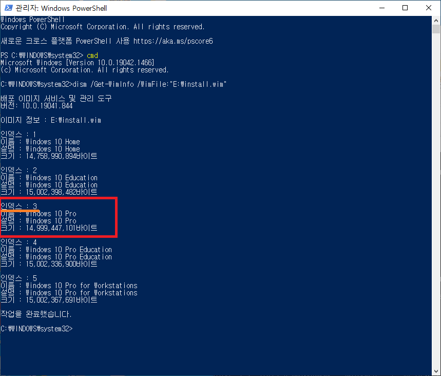
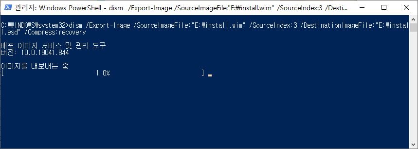

install.wim 파일 esd로 압축 하여 fat32 시스템에 넣기

안녕하세요. 본 글은 스스로를 위한 글에도 해당이 됩니다.

# 서론
잠깐의 서론을 적자면 UEFI 사용 시스템에서 주로 GPT 형식의 FAT32 디스크를 통해 부팅을 합니다. 하지만 FAT32 시스템의 한계로 인하여 4096MB가 넘는 파일의 경우 디스크에 정상적으로 넣을 수 없습니다. 하지만 최근 Windows 설치 ISO의 가장 큰 파일인 install.wim의 경우 4GB를 넘으므로 해당 파일을 복사 혹은 이동을 할 수 없다고 표기 됩니다.

이때 두가지 정도의 방법이 있습니다. 하나는 [Rufus.ie](http://rufus.ie/ko/)에서 `Rufus` 같은 서드파티 어플리케이션을 통해 (NTFS 파티션으로 부팅 가능하게 만들기) 하는 방법이 있고, 하나는 오늘 저희가 할 가장 용량이 큰 `install.wim`을 압축하여 4기가 안쪽으로 만들어 주는 방법 입니다.

저는 2번 방법을 택하겠습니다. 1번의 경우 그저 에서 `Rufus` 앱을 받으시고 윈도우 설치 ISO 파일을 선택한 뒤 부팅 가능 USB를 만들어 주시면 됩니다. 그럴 경우 자동으로 부팅 가능함과 동시에 NTFS 관련 드라이버를 탑제한 자체적 FAT32 부팅 파티션을 만들어 줍니다. 이 부분에 대해서는 생략 하겠습니다.

# 본론
우선 ISO 파일 중 `install.wim` 과 윈도우 시스템이 필요 합니다. 또한 모든 명령어는 관리자 권한으로 실행되어야 합니다.

## 실행 환경
본 글에서는 다음과 같은 환경에서 진행 합니다.

- 사용하는 OS: `Microsoft Windows 10` (Win7 이상이면 다 될 것 입니다)
- 원하는 설치 에디션: `Windows 10 Pro`
- 파일 위치: `E:\install.wim`
- 출력 위치: `E:\install.esd`

위와 다른 환경인 경우 파일 위치나 원하는 설치 에디션을 본인이 원하시는 것으로 바꿔서 글을 읽으시면 됩니다.

## 압축 과정

1. 명령 프롬프트를 관리자 권한으로 실행 합니다.
    - `Win + X` 키를 누른 뒤 `Windows PowerShell 열기 (관리자)` 를 누르시고, `cmd` 명령어를 입력 하여 실행 합니다.
    - 시작 메뉴를 띄운 후 `명령 프롬프트` 혹은 `cmd` 입력 후 `관리자 권한으로 실행` 누르기
2. 아래 명령어를 통해 wim 파일 내 필요한 에디션 번호 확인,  **대소문자 구분 철저!**
    - `dism /Get-WimInfo /WimFile:"E:\install.wim"`
    
    - 필자의 경우 `3`
3. 아래 명령어를 통해 추출, 압축 및 변환 수행, **대소문자 구분 철저**
    - `dism /Export-Image /SourceImageFile:"E:\install.wim" /SourceIndex:3 /DestinationImageFile:"E:\install.esd" /Compress:recovery`
    
    - 사용중인 환경 사양에 따라 수분에서 수십분 정도 소요. 가급적 고성능 환경에서 작업 권장
    - `Export-Image`를 통해 이미지 추출 과정 선택
    - `SourceImageFile`를 통해 원본 이미지 경로 지정
    - `SourceIndex`를 통해 원하는 에디션 선택
    - `DestinationImageFile`를 통해 출력 경로 지정
    - `Compress`를 통해 압축률 지정
4. `install.wim` 제외 모든 파일을 FAT32 시스템에 옮기고, `install.esd`를 대신 넣어주기

이후 USB나 외장 디스크로 부팅하시면 정상적으로 설치가 가능 합니다.