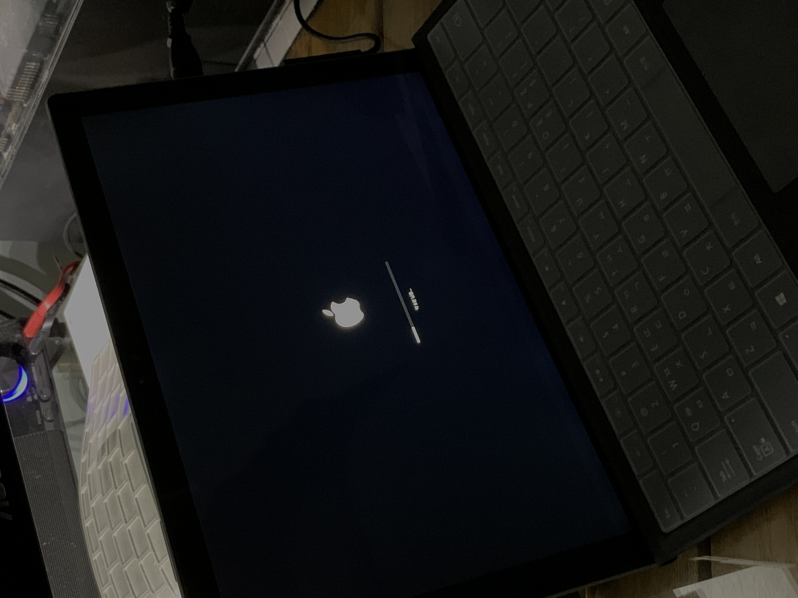

서피스 프로 4 롱텀 후기, 서피스는 내게 적합할까?

오늘은 정말 오랜만이자, 티스토리 이후 처음으로 기기 리뷰를 해보려고 합니다. 서론이 깁니다. 후기는 상단 혹은 우측 `이 페이지에는?`을 참고 바랍니다.

> 2017년 끝물로 구매한 서피스 프로4, 5년 사용 후기
> 그리고 서피스 시리즈, 내개 적합 할까?

이 두 주제로 이야기를 풀어보려 합니다. 필자는 스스로 기기를 물리적이아니라 환경적으로 곱게 쓰는 편이 아니라 어쩌면 조금 다른 관점의 리뷰가 될 수 있습니다.

   
예. 평범하게 쓰진 않습니다.

흔히들 같은 생태계를 구축하여 **컨티뉴이티 (continuity, 연속성)**을 추구하면 무척 편리 하다고 합니다. 가전으로 치면 모든 가전을 LG로, 애플 유저로 치면 모든 기기를 애플 제품으로, 삼성꺼로...등 맞습니다. 이로 말할 수 없을 정도로 편합니다. 하지만 저는 조금은 생각이 다릅니다.

> 내가 필요한 니즈 혹은 기능을 포기 혹은 불편을 감수하면서 생태계를 구축해야할까?

저는 그렇습니다. 스마트폰은 천성 안드로이드 사용자 이면서 iOS의 철저한 앱 컨테이닝에 반하여 iOS를 사용한지 오래 되었습니다. (안드로이드Q를 그렇게 믿었는데...) 그럼 스마트폰에 연결된 스마트 워치는? `아예 안되는 것보다는 났지만 불편하다` 라고 매번 말하는 아이폰 + 갤럭시 워치를 씁니다. 저는 네모난 애플 워치는 곧 죽어도 못쓰겠습니다. 

한발자국 더 나아가 저는 컨티뉴이티도 좋지만 제가 원하고 제가 편한 것을 선호 합니다. 서피스도 마찬 가지 입니다. 서피스 사놓고 윈도우로 부팅한 시간보다 리눅스로 부팅한 시간이 훨씬 많습니다.

위와 같은 맥락으로 어쩌면 조금 특이한 관점으로 리뷰를 써보려 합니다. 우선 아래와 같은 주제로 시작 합니다.

> 나에게 서피스가 맞을까?

애초에 저는 주변분들께 서피스 라는 존재를 잘 추천 하지 않습니다. 누군가가 저에게 **"노트북 추천해줘!"** 하면 저는 **"오, LG 그램좋다네. 아니면 삼성 갤럭시북?"**로 대답합니다. 괜히 서피스, 맥북 이런 것 추천해서 