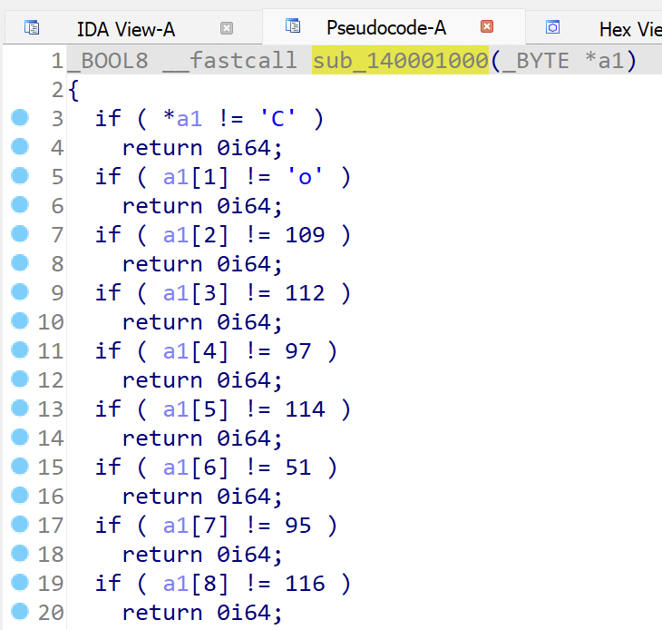

[DreamHack.io] rev-basic-1 풀이

# 환경
CPU: Apple M1   
OS: Microsoft Windows 11 on ARM   
Tools: IDA   

# 문제
URL: [https://dreamhack.io/wargame/challenges/15/](https://dreamhack.io/wargame/challenges/15/)

요약: `chall1.exe` 로부터 `correct` 를 출력 할 수 있는 문자열을 찾기

# 풀이
지난 `rev-basic-0`과 마찬가지로 슈도 코드를 통해 유추.

`sub_140001000` 에서 위와 같이 문자열 체크 하는 것을 확인