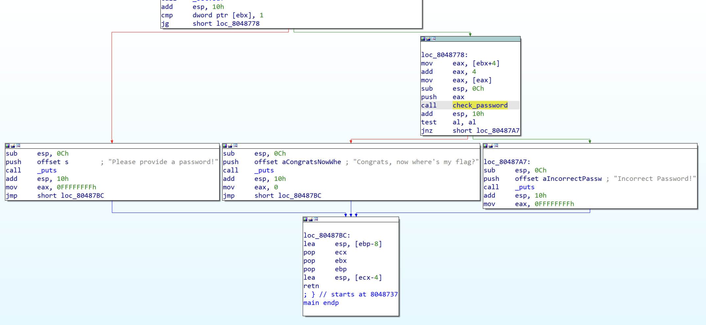

[HackCTF] Welcome_REV 풀이

# Environments

|Name|Config|
|:---:|:---|
|CPU|Apple M1|
|Architecture|ARM64 (Win)<br/>AMD64 (Ubuntu)|
|OS|Microsoft Windows 11 on ARM<br/>Ubuntu 16.04.7 LTS|
|Tools|- Hex-Rays IDA 7.5<br/>- GDB (peda)|

# 문제
URL: [https://ctf.j0n9hyun.xyz/challenges#Welcome_REV](https://ctf.j0n9hyun.xyz/challenges#Welcome_REV)


```
Get Input via arguments
Print Incorrect 또는 Congrats

welcome_rev: ELF 32-bit LSB executable, Intel 80386, version 1 (SYSV), dynamically linked, interpreter /lib/ld-linux.so.2, for GNU/Linux 2.6.32, BuildID[sha1]=c6ed33b1e24a48ad6cc386e50d59504d0d5bb8b9, not stripped
```

문제 형식: 32bit x-executable   
요약: x86 어플리케이션 `welecome_rev` 로부터 `Congrats` 를 출력 할 수 있는 매개변수를 찾기

# File Format


32bit ELF

# checksec

|Name|Status|
|:---:|:---|
|CANARY|ENABLED|
|FORTIFY|disabled|
|NX|ENABLED|
|PIE|disabled|
|RELRO|Partial|

# 풀이
이번 문제는 gdb와 친숙해 지기 위해 gdb로 풀이 후 IDA를 통해 검증.

```
# gdb에서 파일 선택
$ file welcome_rev

# main 함수 부분 peda Disassem
peda$ pdisas main
```


```
0x08048784 <+77>:	call   0x804851b <check_password>
```

위 call을 통해 `check_password` Sub Routine을 호출 하는 것 확인

```
peda$ pdisas check_password
```


`strcmp` 호출 직전 `0x8048850`를 push 하는 것을 확인


Stack 으로부터 `0x8048850 ("SGFja0NURnt3M2xjMG0zXzcwX3IzdjNyNTFuNl93MHJsZEBfQCFfIX0=")` 얻음. 사실 이 때 단순히 이것이 Flag 인줄 알고 제출 시도. 하지만 실패.

지금부터는 단순 문자열이 아닌 Encoding 된 문자열이라 추측하여 [디코딩 사이트 dencode.com](https://dencode.com)을 이용하여 여러 Encoding들을 한번에 확인 및 `Base64` 로 Encoding 된 Flag 임을 확인 및 제출.

---
이제는 IDA를 통해 다른 ~~조금 더 보기 편한~~ 방법으로 재차 확인 시도. 


`main` 으로부터 매개변수로 길이가 1 이상인 값을 받았다면 `check_password` 결과에 따라 `loc_80487A7`로 jmp.


매개변수로 받은 문자열을 자리 수 별로 base64로 Encoding 한 뒤 지정된 스택에 담긴 문자열 (0x8048850)과 strcmp 시도.

# 후기
Dreamhack.io 의 Basic 중 초반 문제보다는 난이도가 올라갔지만 아직은 버틸만...하다. 전지전능한 IDA가 아닌 GDB로 한곳 한곳 거슬러 올라가니 재미있다.